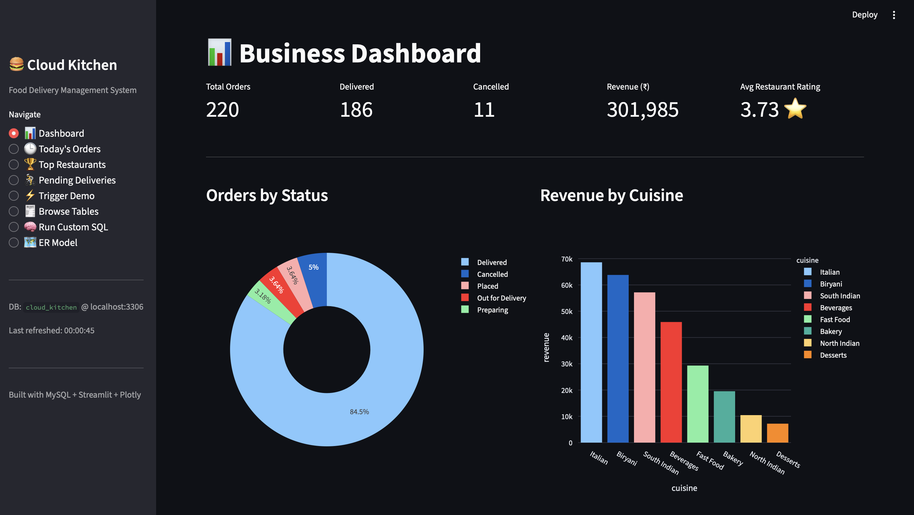
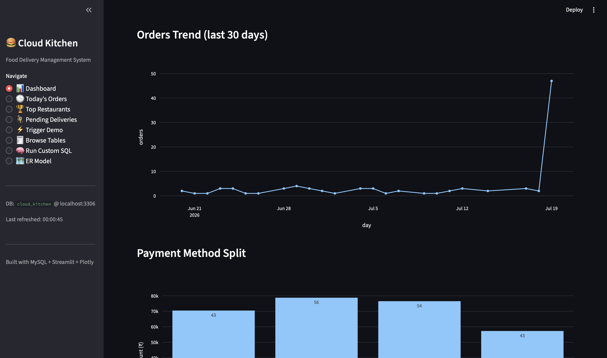
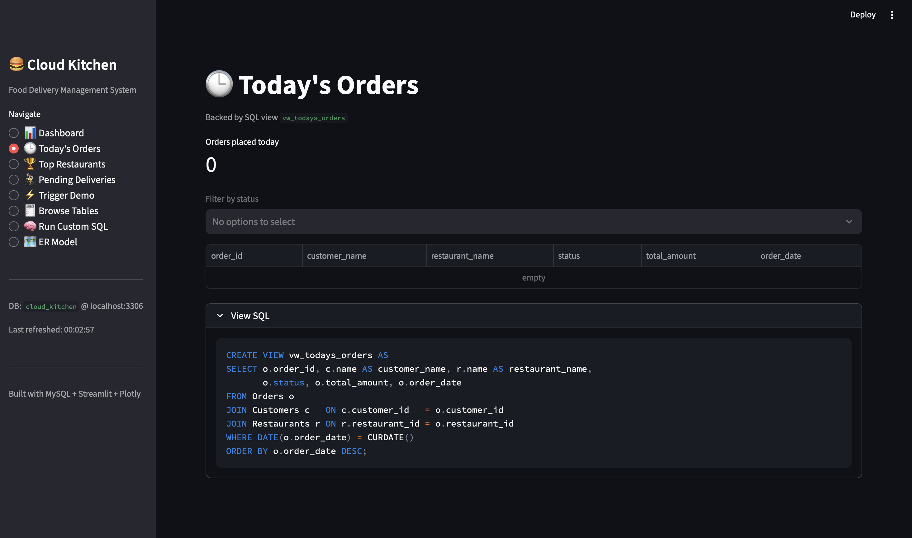
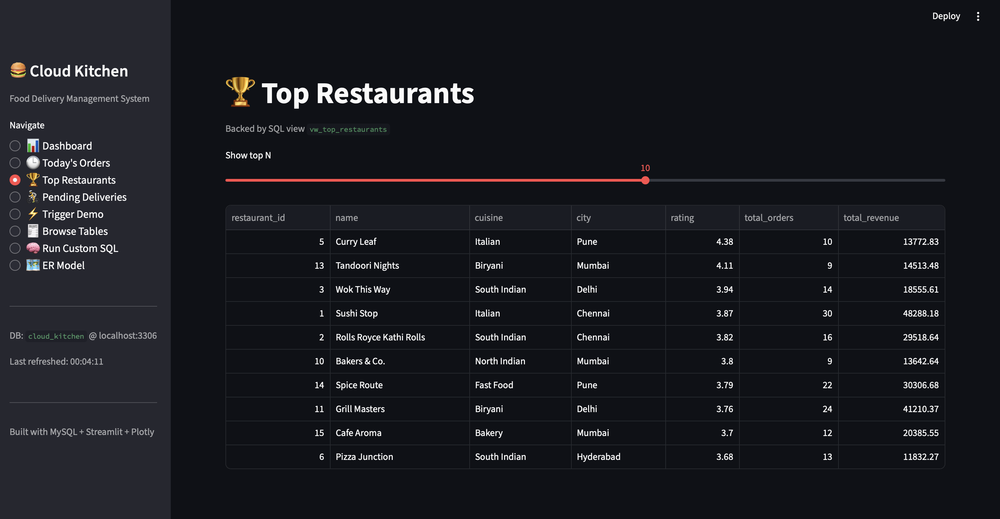
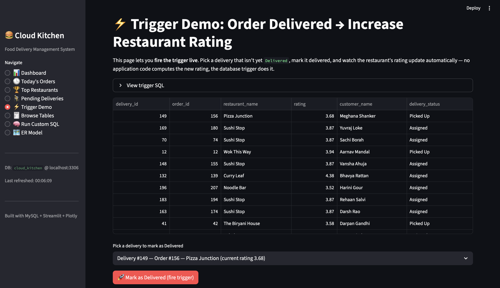
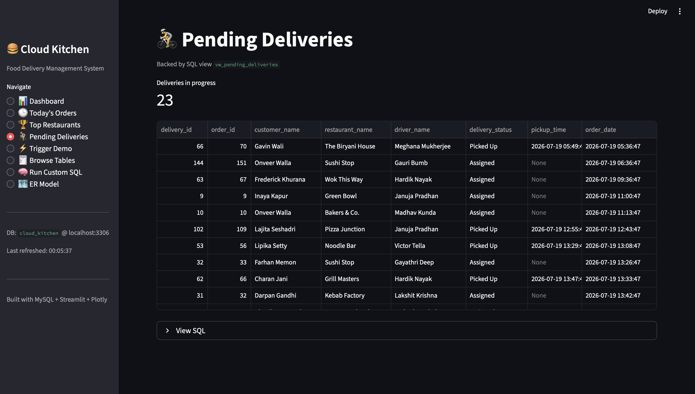
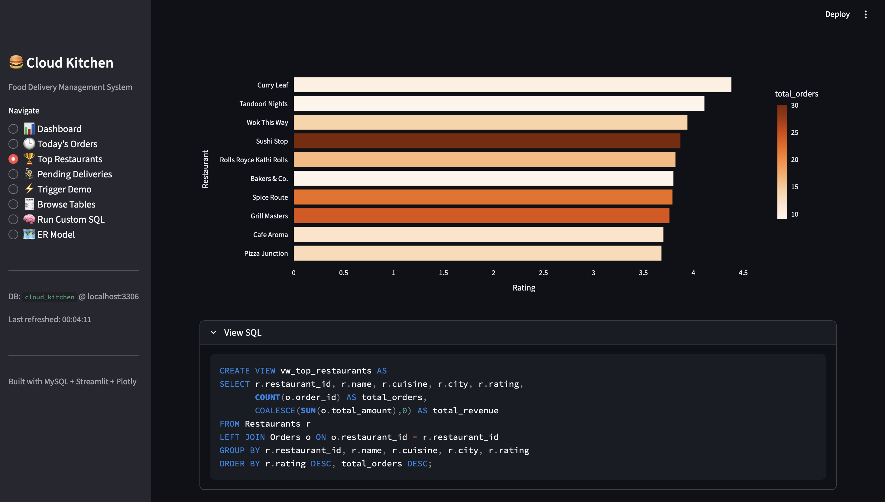
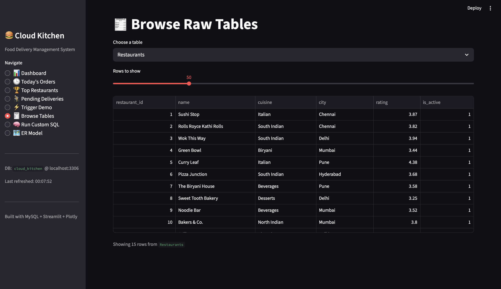
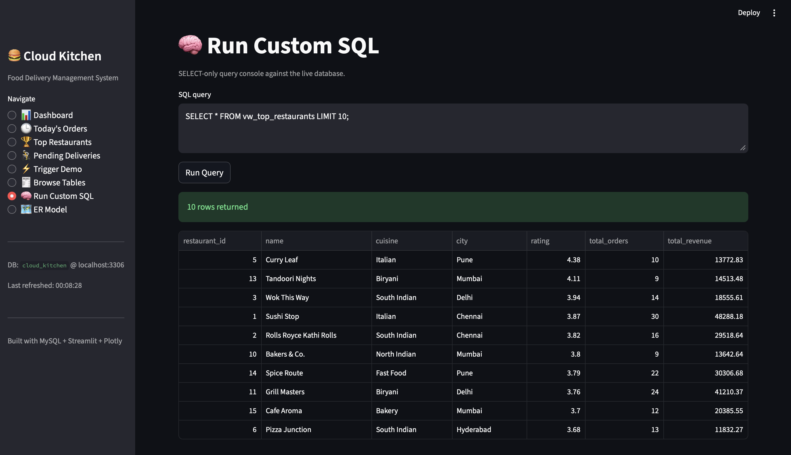
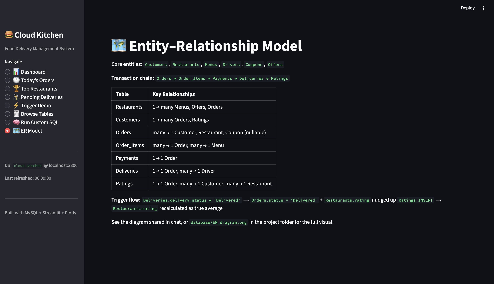

<div align="center">

# 🍔 Cloud Kitchen & Food Delivery Management System

### A MySQL-Based Database Management System with an Interactive Streamlit Analytics Dashboard


A complete Database Management System inspired by modern food delivery platforms such as **Swiggy**, **Zomato**, and **EatClub**, featuring a normalized MySQL database, business automation using SQL triggers, reporting views, and an interactive Streamlit dashboard.

</div>

---

# 📌 Project Overview

The **Cloud Kitchen & Food Delivery Management System** is a real-world DBMS project designed to simulate the backend operations of an online food delivery platform.

The project demonstrates how relational databases can efficiently manage restaurants, customers, menus, orders, payments, deliveries, ratings, and business reporting while maintaining data consistency and integrity.

To enhance user experience, the database is integrated with a **Streamlit Analytics Dashboard** that provides real-time insights through interactive visualizations and SQL-powered reports.

---

# 🎯 Project Objectives

- Design a normalized relational database.
- Manage restaurants, menus, customers, and drivers.
- Process customer orders efficiently.
- Track payments and deliveries.
- Automate business operations using SQL Triggers.
- Generate reports using SQL Views.
- Visualize business insights through an interactive dashboard.
- Demonstrate real-world database design concepts.

---

# 🏗 Project Workflow

```text
Customer Registration
        │
        ▼
Browse Restaurants & Menu
        │
        ▼
Place Order
        │
        ▼
Payment Processing
        │
        ▼
Delivery Assignment
        │
        ▼
Order Delivered
        │
        ▼
Restaurant Rating Updated
        │
        ▼
Analytics Dashboard
```

---

# ✨ Key Features

✅ Restaurant Management

✅ Customer Management

✅ Menu Management

✅ Order Processing

✅ Payment Tracking

✅ Delivery Management

✅ Customer Ratings

✅ Business Automation using SQL Triggers

✅ SQL Reporting Views

✅ Interactive Streamlit Dashboard

✅ Custom SQL Query Execution

✅ Entity Relationship Diagram

---

# 🛠 Technology Stack

| Technology | Purpose |
|------------|---------|
| MySQL 8+ | Database Management |
| Python | Backend Programming |
| Streamlit | Interactive Dashboard |
| SQLAlchemy | Database Connectivity |
| PyMySQL | MySQL Driver |
| Plotly | Data Visualization |
| Faker | Sample Data Generation |
| Pandas | Data Analysis |

---

# 📂 Repository Structure

```text
cloud-kitchen-food-delivery-management-system
│
├── app/
│   └── app.py
│
├── database/
│   ├── db_config.py
│   ├── schema.sql
│   └── seed_data.py
│
├── screenshots/
│   ├── dashboard.png
│   ├── orders_trend.png
│   ├── todays_orders.png
│   ├── top_restaurants.png
│   ├── restaurant_ratings.png
│   ├── pending_deliveries.png
│   ├── trigger_demo.png
│   ├── browse_tables.png
│   ├── custom_sql.png
│   └── er_diagram.png
│
├── queries.sql
├── LICENSE
├── README.md
├── requirements.txt
├── .env.example
├── Cloud Kitchen Project Report.pdf
└── Cloud Kitchen Project.pptx
```

---

# 🗄 Database Design

The project consists of **11 normalized tables**.

| Table | Description |
|--------|-------------|
| Restaurants | Stores restaurant information |
| Menus | Restaurant menu items |
| Customers | Customer records |
| Drivers | Delivery partner details |
| Orders | Customer orders |
| Order_Items | Ordered food items |
| Payments | Payment transactions |
| Deliveries | Delivery tracking |
| Ratings | Customer reviews |
| Coupons | Discount coupons |
| Offers | Promotional offers |

---

# 🔥 SQL Trigger

The database includes automated business logic using SQL Triggers.

### Trigger Functionality

- Detects completed deliveries.
- Updates order status.
- Adjusts restaurant ratings.
- Maintains data consistency automatically.

This demonstrates how business rules can be enforced directly within the database.

---

# 📊 SQL Views

The project contains reporting views for business analytics.

### Included Views

- Today's Orders
- Top Restaurants
- Pending Deliveries

These views simplify reporting and improve dashboard performance.

---

# 📈 Dashboard Modules

The Streamlit dashboard provides multiple analytical pages.

### 📊 Dashboard

Business KPIs and overall performance.

### 📈 Orders Trend

Daily order trends and business growth.

### 🕒 Today's Orders

Orders placed today.

### 🏆 Top Restaurants

Best-performing restaurants based on ratings.

### ⭐ Restaurant Ratings

Restaurant performance visualization.

### 🚚 Pending Deliveries

Track active deliveries.

### ⚡ Trigger Demonstration

Visual demonstration of SQL Trigger execution.

### 📂 Browse Tables

View records from every database table.

### 🧠 Custom SQL

Execute SELECT queries directly from the dashboard.

### 🗺 ER Diagram

Visual representation of database relationships.

---

# 📸 Project Screenshots

## 📊 Dashboard



---

## 📈 Orders Trend



---

## 🕒 Today's Orders



---

## 🏆 Top Restaurants



---

## ⭐ Restaurant Ratings



---

## 🚚 Pending Deliveries



---

## ⚡ Trigger Demo



---

## 📂 Browse Tables



---

## 🧠 Custom SQL



---

## 🗺 Entity Relationship Diagram



---

# ⚙ Installation

Clone the repository

```bash
git clone https://github.com/aakashnath/cloud-kitchen-food-delivery-management-system.git
```

Install dependencies

```bash
pip install -r requirements.txt
```

Configure database credentials

```text
Create a .env file using .env.example
```

Create database

```bash
mysql -u root -p < database/schema.sql
```

Insert sample data

```bash
python database/seed_data.py
```

(Optional) Explore sample SQL queries:

```sql
Open queries.sql in MySQL Workbench or VS Code to execute sample SELECT, JOIN, GROUP BY, reporting, and view queries.
```

Launch dashboard

```bash
streamlit run app/app.py
```

---
---

# 📝 Sample SQL Queries

The repository includes a dedicated **queries.sql** file containing practical SQL queries for demonstration and learning purposes.

It covers:

- SELECT Statements
- WHERE Clause
- ORDER BY
- GROUP BY
- INNER JOIN
- Aggregate Functions
- SQL Views
- Reporting Queries

Example:

```sql
SELECT restaurant_name, rating
FROM Restaurants
ORDER BY rating DESC;
```

For additional queries, refer to **queries.sql**.

---
# 💡 Future Enhancements

- User Authentication
- Online Payment Gateway
- Order Notifications
- Admin Dashboard
- Mobile Application
- AI-based Restaurant Recommendation
- Real-time Delivery Tracking
- Cloud Deployment

---

# 🎓 Learning Outcomes

This project demonstrates practical knowledge of:

- Database Management Systems
- Relational Database Design
- SQL Programming
- Database Normalization
- SQL Triggers
- SQL Views
- CRUD Operations
- Data Visualization
- Python Database Connectivity
- Interactive Dashboard Development

---

# 👨‍💻 Developed By

### 👤 Aakash Nath

### 👤 Abhijit Roy

---

# ⭐ Support

If you found this project useful, please consider giving it a ⭐ on GitHub.

---

<div align="center">

## 🍽 Bringing Database Concepts to Life Through Real-World Food Delivery Analytics

</div>
